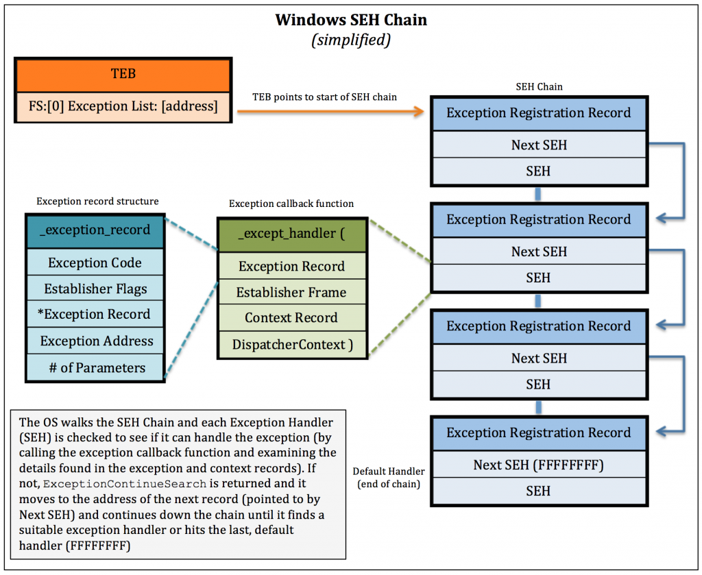

#                     CVE-2010-3333分析

## 1.前置准备工作

这次没啥需要前置准备的,直接开始分析干上吧

## 2.开始干活了

### 1.生成样本

按照漏洞战争的书上面的例子,我们先生成了Crash.rtf文件分析这次溢出的原因,我们可以按照漏洞战争的例子,一步步的走下来,定位到漏洞成因,这次漏洞的成因不是主要的分析重点,我们学习的是当栈溢出的时候,利用SEH执行我们的shellcode

### 2.SEH探究




如上图 可以看到SEH的 特点是 

1. SEH是在栈上的
2. SEH是一个链式结构,操作系统For循环去找函数Exception Handler一个个处理
3. 先获得处理权的Exception Handler是在栈底部

我们栈溢出覆盖的是从底部地址向高部地址覆盖  所以我们覆盖的大部分是都是第一个获得处理权的Exception Handler

下面来给个具体的例子展示下SEH 的覆盖,[Free MP3 CD Ripper 2.6 - '.mp3' Buffer Overflow (SEH)](https://www.exploit-db.com/exploits/45403)

#### 1.MP3样本的分析

这个样本是个SEH利用,首先断在ntdll!KiUserExceptionDispatcher,为啥中断在这个函数,KiUserExceptionDispatcher是R3的处理异常分发函数,这里面会去找寻SEH链进行处理,我们需要看下SEH被覆盖成了什么

按照 文章中的 生成 exploit.mp3 然后点击转换 可以看到触发了异常了


调试器拿到了第一轮的处理权限,不要管, 输入 g


可以看到开始用KiUserExceptionDispatcher 分发异常了, 这个时候SEH肯定被覆盖了,如下图


现在我们看下EXCEPTION_REGISTRATION_RECORD


```c++
typedef struct _EXCEPTION_REGISTRATION_RECORD
{
    PEXCEPTION_REGISTRATION_RECORD Next;
    PEXCEPTION_DISPOSITION Handler;
} EXCEPTION_REGISTRATION_RECORD,*PEXCEPTION_REGISTRATION_RECORD; 
```

可以看到我们把Next 覆盖成了 0x909006eb   Handler 覆盖成了 0x66e42121,异常发生后Handler 被执行  

```asm
66e42121 5b              pop     ebx
66e42122 5d              pop     ebp
66e42123 c3              ret
```

可以看出来Handler 也是特意选的 pop pop ret模式,我们解释下为什么会需要这种模式; EXCEPTION_REGISTRATION_RECORD ->Handler 指向一个函数，这个函数原型是 

```c++
EXCEPTION_DISPOSITION 
__cdecl _except_handler(
    struct _EXCEPTION_RECORD *ExceptionRecord,
    oid EstablisherFrame,
    struct _CONTEXT *ContextRecord,
    void * DispatcherContext
);
```

当异常处理函数被调用的时候,EstablisherFrame的值是EXCEPTION_REGISTRATION_RECORD的值,此时EstablisherFrame是异常处理函数ESP+8的地址,看下调试器就知道


pop pop ret 就是希望跳转到这个地址  jmp esp+8(jmp EXCEPTION_REGISTRATION_RECORD ); 然后回到一开始我们分析的,EXCEPTION_REGISTRATION_RECORD这个地址的数据已经被我们覆盖了

```asm
07dbfee8 eb06            jmp     07dbfef0
```

这个地址的汇编指令是 eb 06；也就是EIP现在到 07dbfee8 + 2 + 6 = 07dbfef0,为啥这个是06呢,EXCEPTION_REGISTRATION_RECORD的结构大小就是8,8-2 = 6；其实这个的目的就是需要将EIP指向EXCEPTION_REGISTRATION_RECORD后面的shellcode,想出这个稳定模式的人有点小6️⃣,哈哈哈,这个mp3样本的shellcode就是弹出个计算器,后面的弹出计算器的Shellcode我们就不分析了, 相信关于SEH的这种利用原理应该解释的比较清楚

#### 2.参考来源

1. https://www.securitysift.com/windows-exploit-development-part-6-seh-exploits/

2. https://www.cnblogs.com/Wrong-Side/p/4456268.html


## 3.对Exploit的完善

### 1.xp 上的利用 

上面我们学写了SEH的原理,为啥要学习这个玩意,因为我用msf生成的样本是Office 2003 sp3 in Xp sp3,我安装的Office是Office 2003,样本上去后就Crash了


明显是栈覆盖的不给力啊, 我们还是尝试下修复

https://github.com/rapid7/metasploit-framework/blob/master/modules/exploits/windows/fileformat/ms10_087_rtf_pfragments_bof.rb 这个是漏洞样本的产生源码,看不太懂,看样子是这个没找对

```asm
'Offsets' => [ 24580, 51156 ],
'Ret' => 0x30001bdd # p/p/r in winword.exe
```

经过一番摸索,Offsets貌似指的是Ret这指令在文件中的偏移,所以我需要寻找自己的offset,以及自己的shllcode


offset很好找  (0012f908 - 00123dc0) *2 + 34 = 000176c4, 这个地方应该放Handler的地址,我们用windbg mona seh 找下pop pop ret 的指令

```python
.load pykd.pyd

!py mona seh
```

然后去seh.txt里面找合适的跳板，我找了 3014676b , 前面再填写下eb 06 xx xx 就可以了

```asm
WINWORD+0x14676b:
3014676b 5e              pop     esi
3014676c 5f              pop     edi
3014676d c3              ret
```

然后需要生成shellcode了


最后我们把构造好的样本再测试下,会发现计算器弹出来了, oh yeah

### 2.win7上的利用

这个先不分析了吧,看rb也是能覆盖SEH,win7上 Office 2007 也是有模块下面五项全是FALSE,这和xp利用就没区别了

Rebase | SafeSEH | ASLR  | NXCompat | OS Dll

## 4.总结

1. 对于SEH覆盖的poc调试,需要先断在KiUserExceptionDispatcher函数,而且由于覆盖SEH,所以溢出点也比较直接
2. SafeSEH这个很容易被绕过,更好的防御SEH覆盖的问题,可以先遍历每个线程的SEH表,保存下来.Hook KiUserExceptionDispatcher 当异常发生的时候,检查对应线程的SEH表是否被修改,但是这样的问题就是当我们Hook KiUserExceptionDispatcher 的时候,我们自己的处理函数如果崩溃, 这种情况下还能分析dump么?
3. ASLR对于栈溢出的缓解非常有效,单一的栈溢出很难绕过ASLR

